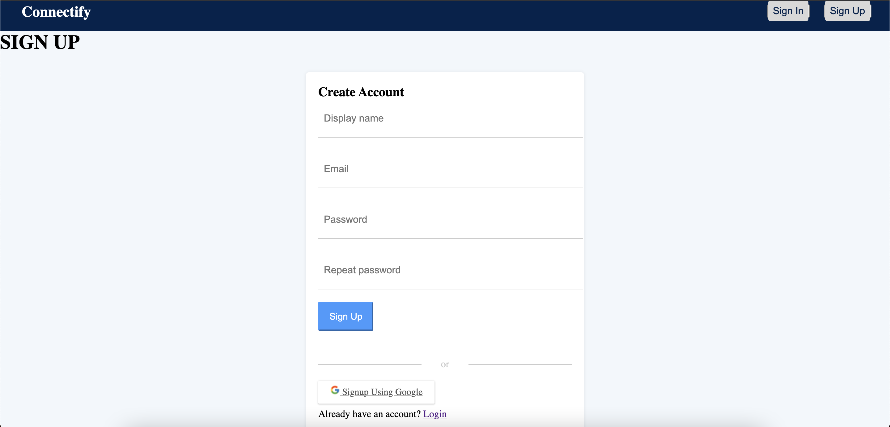
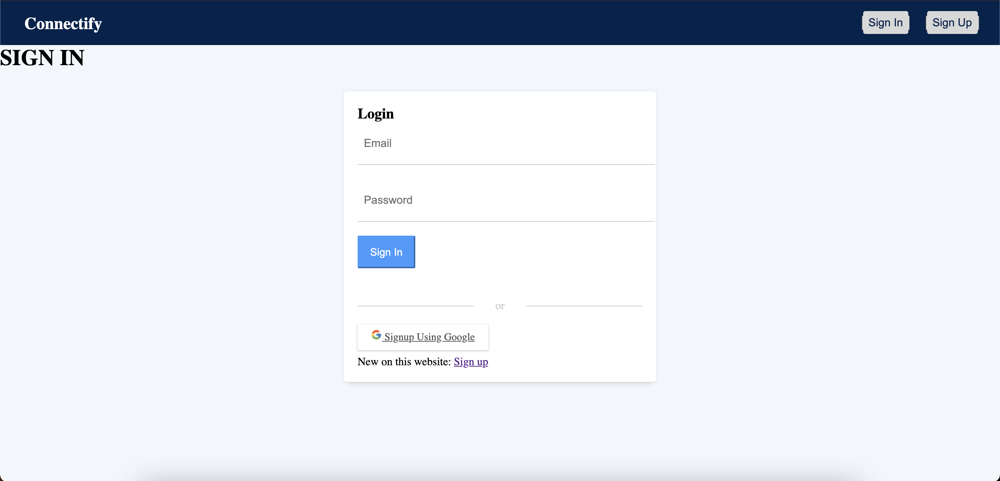
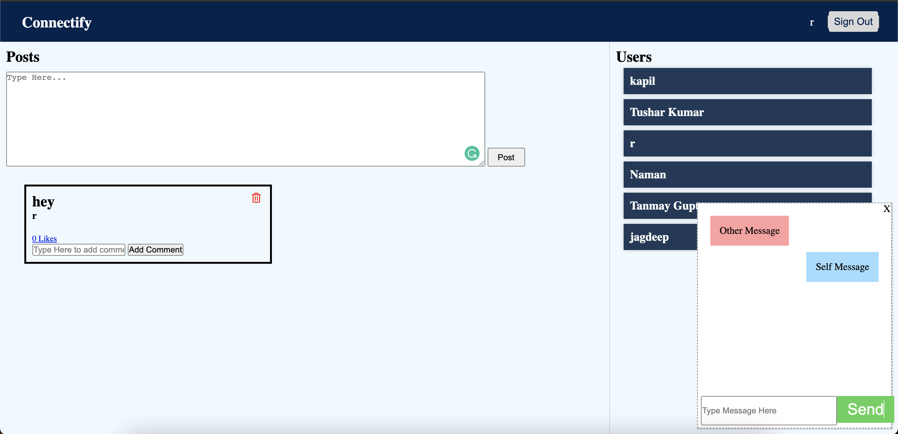

# CONNECTIFY-A Social media website

## Description
It is a social media website which offers many cool features like a chat engine,a wall to share your posts and comments and a mailing service too.

## Screenshots

## Technologies Stack:

### Components
* HTML,CSS,Javascript,jQuery,Ajax,Sass
* Node.js,MongoDB,Express.js

### Insights

* passport-jwt strategy for authentication and authorization.
* passport-google-oauth2 strategy for social authentication through  google.
* used Nodemailer to send out emails.
* used socket.io for implementing chat engine.

## How to Install

* Clone the project onto your local machine.
* Then cd connectify
* npm install
* npm start
* Visit your app at http://localhost:8000.

